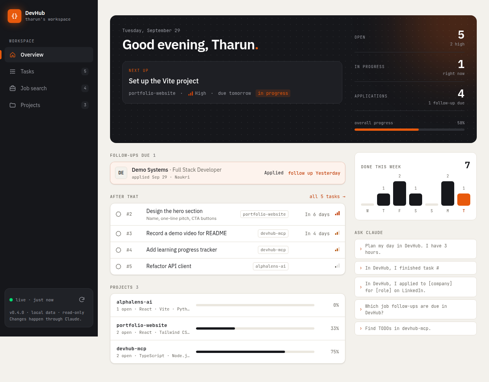

# DevHub MCP

A personal developer and career assistant built as a **Model Context Protocol (MCP) server**. It lets AI assistants like Claude manage my projects, tasks, job applications and code TODOs through natural language, backed by a local SQLite database. A React dashboard shows the same data in the browser.

> "What should I work on today?" · "I applied to Zoho for a Full Stack role." · "Find TODOs in devhub-mcp."



## Why I built this

As a 2026 full stack developer fresher, I wanted to learn MCP by building something I would actually use every day, not a toy example. I keep losing track of my projects, tasks and learning progress across different folders and notes, so I am building one local assistant that my AI can talk to. This project is the first step towards my own personal AI assistant that will eventually help with GitHub, job applications and interview preparation.

## Features (v0.4)

**Projects and tasks**
- List, create, update and archive projects (no hard deletes; archived items can be restored)
- Tasks per project with priorities and due dates
- Pending tasks sorted by priority, then due date

**Job search**
- Job application tracker: company, role, status, source, applied date, follow-up date, notes
- "Which follow-ups are due?" in one call
- `plan_my_day` prompt combines pending tasks and due follow-ups

**Code insight**
- Read a project's README (MCP resource template `project://{name}/readme` and a tool)
- `find_todos`: scan a project folder for `TODO`, `FIXME`, `HACK`, `XXX` and `BUG` comments

**Dashboard**
- React + Vite + Tailwind dashboard: dark sidebar and hero on a light workspace, "next up" task, weekly activity chart, issue-tracker task list, job-search stages, project progress, copy-ready Claude prompts
- Mobile friendly, refreshes itself every 30 seconds and whenever you come back to the tab
- Served by a read-only local JSON API (`npm run web`)

**Quality**
- 55 automated tests with `node:test` and in-memory SQLite
- Versioned database migrations (existing databases upgrade automatically)
- Friendly, actionable errors that the AI can act on

## MCP capabilities

| Type | Name | What it does |
|---|---|---|
| Tool | `list_projects`, `create_project`, `update_project`, `archive_project` | Manage projects |
| Tool | `list_tasks`, `create_task`, `update_task`, `archive_task` | Manage tasks |
| Tool | `list_applications`, `create_application`, `update_application`, `archive_application` | Track job applications |
| Tool | `read_project_readme` | Read a project's README.md |
| Tool | `find_todos` | Find TODO/FIXME comments in a project folder |
| Resource | `project://{name}/readme` | Attach a project README as context |
| Prompt | `plan_my_day` | Suggest up to 3 things to do today |

## Example

| You say to Claude | What happens |
|---|---|
| "Show me my current projects." | `list_projects` returns active projects |
| "Update DevHub: I started working on portfolio-website." | `update_project` sets status to `in_progress` |
| "What tasks are pending in DevHub?" | `list_tasks` returns tasks sorted by priority and due date |
| "I applied to Zoho for Full Stack Developer on LinkedIn. Remind me to follow up on Oct 6." | `create_application` with source and follow-up date |
| "Which job follow-ups are due?" | `list_applications` with `followUpDue: true` |
| "Find TODOs in devhub-mcp and make tasks for the important ones." | `find_todos`, then `create_task` |
| "Delete test-project." | `archive_project` hides it safely (nothing is deleted) |

## Architecture

```
Claude Desktop (MCP host)                     Browser
        │  JSON-RPC over stdio                   │  HTTP (localhost only)
        ▼                                        ▼
src/index.ts  (MCP bootstrap)            dashboard/  (React app) → src/web/main.ts
src/mcp/*Tools.ts, prompts.ts            src/web/server.ts  (read-only JSON API)
        │   MCP layer: zod validation,           │
        │   result formatting                    │
        └──────────────┬─────────────────────────┘
                       ▼
src/services/*.ts   service layer: business logic, friendly errors, safe file access
                       ▼
src/db/database.ts  data layer: SQLite schema and versioned migrations
```

Both the MCP server and the dashboard reuse the **same service layer**, so logic is written once.

```
src/
├── index.ts              MCP server entry point
├── config.ts             environment variables (fail fast)
├── version.ts            version from package.json
├── errors.ts             DevHubError (safe-to-show errors)
├── db/                   database + migrations
├── services/             projects, tasks, applications, README, TODO scanner, folder safety
├── mcp/                  MCP tools, resource template and prompt
├── web/                  dashboard HTTP server
└── utils/                small helpers
dashboard/                React + Vite + Tailwind frontend (its own package.json)
```

## Tech stack

| Technology | Why |
|---|---|
| TypeScript (strict) | Type safety and early error detection |
| Node.js 22 | Runtime; built-in `node:sqlite`, `node:test`, `node:http` and `--env-file` (no extra dependencies) |
| MCP TypeScript SDK (v1) | Official protocol implementation |
| zod | Input validation for every tool and API query |
| SQLite | Single-file local database, no server needed |
| React 19 + Vite + Tailwind CSS 4 | Dashboard UI with components and fast development |

## Setup

**Requirements:** Node.js 22.13+, Claude Desktop

```bash
git clone https://github.com/Mtharun/devhub-mcp.git
cd devhub-mcp
npm install
cp .env.example .env    # then set DEVHUB_DATA_DIR (and optionally the other values)
npm run build
npm test                # runs the automated test suite
```

### Environment variables

| Variable | Required | Meaning |
|---|---|---|
| `DEVHUB_DATA_DIR` | Yes | Absolute folder for `devhub.db` (keep it outside the repository) |
| `DEVHUB_ALLOWED_ROOTS` | No | `;`-separated absolute folders DevHub may read project files from. Empty = any project folder |
| `DEVHUB_WEB_PORT` | No | Dashboard port, default `4321` |

### Connect to Claude Desktop

Add the server to your Claude Desktop config (`claude_desktop_config.json`, open it via Settings → Developer → Edit Config):

```json
{
  "mcpServers": {
    "devhub": {
      "command": "node",
      "args": ["/absolute/path/to/devhub-mcp/build/index.js"],
      "env": {
        "DEVHUB_DATA_DIR": "/absolute/path/to/devhub-data",
        "DEVHUB_ALLOWED_ROOTS": "/absolute/path/to/your/projects"
      }
    }
  }
}
```

Fully quit and restart Claude Desktop after any config or code change.

### Open the dashboard

First time only:

```bash
npm run dashboard:install
npm run build:dashboard
```

Then:

```bash
npm run web
```

Open http://localhost:4321. The dashboard is read-only; make changes by talking to Claude.

To work on the dashboard itself, run `npm run web` in one terminal and `npm run dashboard:dev` in another, then open http://localhost:5173 (changes appear instantly; `/api` calls are proxied to port 4321).

## Security and safety design

- **Local-first:** all data stays in a local SQLite file outside the repository
- **No hard deletes:** projects, tasks and applications are archived, never permanently removed
- **SQL injection safe:** all values use parameterized queries (`?` placeholders); column names only come from fixed code
- **Input limits:** zod enforces lengths, enums, dates and URL formats
- **Safe file access:** fixed file names (no `../` tricks), size limits, symlinks not followed, `.env` files never scanned, optional folder allow-list (`DEVHUB_ALLOWED_ROOTS`)
- **Dashboard:** binds to `127.0.0.1` only, checks the `Host` header (DNS rebinding protection), GET only, only plain file names from the built dashboard folder, Content Security Policy, text rendered with `textContent` (XSS safe)
- **Tool annotations:** read-only and destructive hints for host approval flows
- **Database constraints:** `UNIQUE`, `CHECK` and foreign keys as a last line of defense
- **Migrations:** each schema change runs in a transaction; the app refuses databases from a newer version

## Roadmap

- [x] Project management (list, create, update, archive)
- [x] Tasks per project (priorities, due dates)
- [x] Project README as an MCP resource
- [x] `plan_my_day` prompt
- [x] Automated tests (`node:test`)
- [x] TODO scanner for local project folders
- [x] Job application tracker
- [x] REST API and dashboard (read-only)
- [x] React dashboard (sidebar workspace, task list, job stages, project progress)
- [ ] Learning progress and developer notes
- [ ] Interview preparation prompts
- [ ] Connect the official GitHub MCP server alongside DevHub
- [ ] Write actions in the dashboard (with authentication)

## About

Built by Tharun as a hands-on way to learn MCP, TypeScript and full stack architecture.
